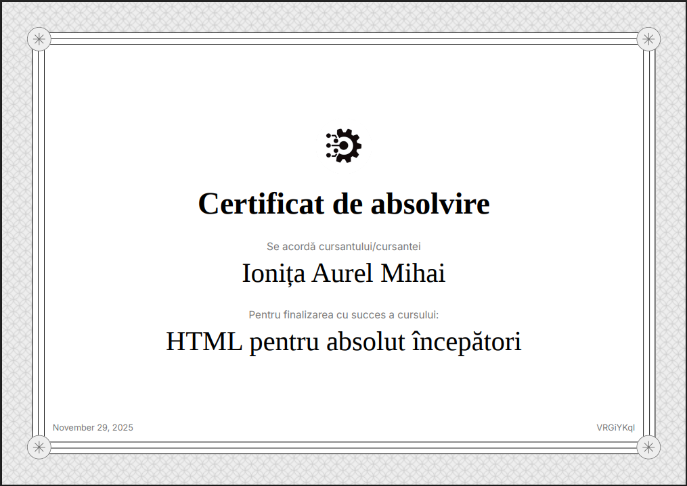

# Ionita Aurel Mihai - Personal Portfolio 🌟



[](https://reactjs.org/)
[](https://www.typescriptlang.org/)
[](https://vitejs.dev/)
[](https://tailwindcss.com/)

## Description 📝

Welcome to the personal portfolio of **Ionita Aurel Mihai**, a dedicated full-stack developer with a keen interest in crafting innovative web solutions. This dynamic website serves as a comprehensive showcase of professional expertise, creative projects, and technical proficiency in modern web development. Leveraging cutting-edge technologies, the portfolio not only highlights completed works but also demonstrates a commitment to clean code, user-centric design, and scalable architecture.

The site is meticulously built with React and TypeScript for robust type safety and component reusability, accelerated by Vite's lightning-fast build process. Tailwind CSS ensures a sleek, responsive design that adapts seamlessly across devices, while shadcn/ui components provide polished, accessible UI elements. Supabase powers backend functionalities, including an intelligent AI assistant that enhances user interaction.

### Key Features ✨
- **Hero Section** 🚀: Dynamic animations and a compelling personal narrative to captivate visitors immediately.
- **About Section** 👨‍💻: In-depth biography covering professional journey, education, and personal interests.
- **Projects Gallery** 💼: Interactive showcase of diverse projects, featuring:
  - High-quality images and live demos
  - Detailed descriptions with tech stacks used
  - Links to GitHub repositories and deployed versions
  - Examples include Christmas Memory Game, Geolocation API integrations, and Green Week environmental projects
- **Skills Overview** 🛠️: Categorized competencies with proficiency levels:
  | Category | Technologies |
  |----------|--------------|
  | Frontend | React, TypeScript, HTML5, CSS3, JavaScript |
  | Backend | Node.js, Express, Supabase |
  | Tools | Git, VS Code, Figma, Postman |
  | Styling | Tailwind CSS, shadcn/ui |
- **Certifications** 🏆: Accredited achievements displayed with verification links.
- **Blog Platform** 📚: Content-rich articles on web development topics including programming basics, web development, Git & GitHub, and mobile development with Flutter, with features like:
  - Search functionality
  - Category filtering
  - SEO-optimized posts
  - Related posts suggestions
- **Contact Integration** 📞: Multi-channel contact options including forms, social links, and direct messaging.
- **AI Assistant** 🤖: Powered by Supabase Edge Functions, offering contextual responses about projects and technologies.

Performance optimizations include lazy loading, code splitting, and efficient asset management, ensuring fast load times. Security measures encompass input validation, HTTPS enforcement, and secure API integrations. Accessibility is prioritized with semantic HTML, ARIA attributes, and keyboard navigation support.

This portfolio not only reflects technical skills but also embodies a passion for continuous learning and community contribution in the web development ecosystem.

### Tech Stack 🛠️
- **Core Framework**: React ⚛️ with TypeScript 📘 for type-safe development
- **Build Tool**: Vite ⚡ for rapid development and optimized production builds
- **Styling**: Tailwind CSS 🎨 with PostCSS for utility-first CSS
- **UI Library**: shadcn/ui based on Radix UI primitives for consistent, accessible components
- **Backend & Database**: Supabase 🗄️ for real-time database, authentication, and serverless functions
- **Development Tools**: ESLint 🔍 for code quality, Git for version control
- **Deployment**: Compatible with Vercel, Netlify, or any static hosting platform

### Screenshots 📸
*(Add screenshots here when available)*
- Hero Section
- Projects Showcase
- Skills Dashboard
- Blog Interface

### Installation & Setup 🚀
1. **Prerequisites**: Ensure Node.js (v16+) and npm are installed.
2. **Clone Repository**: `git clone https://github.com/yourusername/ionitaaurelmihai.git`
3. **Navigate**: `cd ionitaaurelmihai`
4. **Install Dependencies**: `npm install`
5. **Environment Setup**: Copy `.env.example` to `.env` and configure Supabase keys.
6. **Development Server**: `npm run dev` - Launches on `http://localhost:5173`
7. **Build Production**: `npm run build`
8. **Preview Build**: `npm run preview`
9. **Linting**: `npm run lint` to check code quality

### Project Structure 📁
```
ionitaaurelmihai/
├── public/                 # Static assets (images, icons)
│   ├── projects/          # Project screenshots
│   └── *.png              # Tech stack icons
├── src/
│   ├── components/        # Reusable UI components
│   │   ├── ui/           # shadcn/ui components
│   │   └── *.tsx         # Custom components (Hero, Projects, etc.)
│   ├── pages/            # Route-based page components
│   ├── data/             # Static data files (projects.ts, certifications.ts)
│   ├── hooks/            # Custom React hooks
│   ├── integrations/     # External service integrations (Supabase)
│   └── lib/              # Utility functions and configurations
├── supabase/              # Backend functions and config
├── *.config.*            # Configuration files (Vite, Tailwind, etc.)
└── package.json          # Dependencies and scripts
```

### API Integrations 🔗
- **Supabase**: Handles user authentication, database queries, and AI assistant functionality via Edge Functions.
- **Geolocation API**: Integrated in projects for location-based features.
- **External Links**: GitHub for code repositories, LinkedIn for professional networking.

### Contributing 🤝
Contributions are welcome! Please follow these steps:
1. Fork the repository
2. Create a feature branch: `git checkout -b feature/amazing-feature`
3. Commit changes: `git commit -m 'Add amazing feature'`
4. Push to branch: `git push origin feature/amazing-feature`
5. Open a Pull Request

For major changes, please discuss in an issue first.

### Testing 🧪
- Run tests: `npm test` (if implemented)
- Manual testing guidelines for UI components and integrations

### Deployment 🌐
- **Vercel**: Connect GitHub repo for automatic deployments
- **Netlify**: Drag-and-drop build folder or integrate with Git
- **Custom**: Use `npm run build` output in any static host

### License 📄
This project is licensed under the MIT License - see the [LICENSE](LICENSE) file for details.

### Acknowledgments 🙏
- Thanks to the open-source community for tools like React, Vite, and Tailwind CSS
- Special appreciation for shadcn/ui and Supabase for empowering modern web development

### Contact 📧
- **Live Site**: [https://ionitaaurelmihai.vercel.app/](https://ionitaaurelmihai.vercel.app/)
- **Email**: aurel.ionita@example.com (placeholder)
- **LinkedIn**: [linkedin.com/in/ionitaaurelmihai](https://linkedin.com/in/ionitaaurelmihai)
- **GitHub**: [github.com/itsiamdev](https://github.com/itsiamdev)

---

*Built with ❤️ by Ionita Aurel Mihai*
